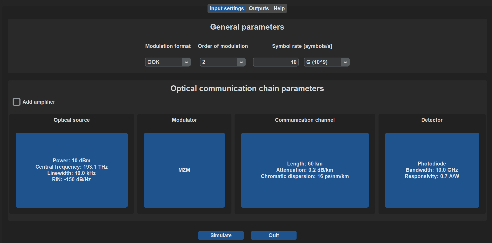

# OpticalSimulation

This repository is **Python** simulation application that simulates optical fiber communication. Purpose of the application is to **demonstrate** and **visualize** influence of some parameters of parts of optical communication model. Simulations should also provide better understanding of optical modulation and optical signal detection.

In the main window of application there is displayed communication model whose parameters can be changed by user. User can also set some general parameters of the communication such as transmission speed or modulation. Outputs of simulation are presented to the user in numeric and graphical form. In addition a little help is included in the app which contains simple descriptions of properties that can user change.

## Used packages

Main function package is **OptiCommPy**. With this package simulation core has been created. Some functions from OptiCommPy has been modified and the new ones have been created in a way that they are compatible with OptiCommPy ones. Github to this package <https://github.com/edsonportosilva/OptiCommPy>.

Graphical user interface has been created with combination of Tkinter and CustomTkinter packages. CustomTkinter project can be visited on <https://github.com/TomSchimansky/CustomTkinter>.

## Available parameters settings

* General parameters - Modulation format, Order of modulation, Symbol rate

* Optical source parameters - Power, Central frequency, Linewidth, RIN

* Modulator parameters - Type

* Transmission channel parameters - Length, Attenuation, Chromatic dispersion

* Detector parameters - Type, Bandwidth, Responsivity

* Optical amplifier parameters - Position in channel, Gain, Noise figure, Sensitivity

## Available outputs

* Numeric values - Transmitted power, Received power, Transmission speed, BER, SER, SNR

* Graphical outputs - Information signal in time, Optical signal in time, Spectrums, Constellation diagrams, Eye diagrams

## Example outputs

* **OOK modulated signal**

* **QPSK constellations diagrams**

* **PAM4 eye diagrams**

## Installation

Because project contains only source scripts the recommended installation is:

1. Clone github repository of the project

        git clone https://github.com/jurkovicmartin/OpticalSimulation

2. Install OptiCommPy package. The package will also install other needed packages like numpy, matplotlib, etc.

        pip install OptiCommPy

3. Install Tkinter and CustomTkinter package

        pip install tk

        pip install customtkinter

4. This should be everything needed for compilation.

    Now run "app.py" script to start the application. You can run it with some python code editor or by console.

    For console start navigate to the folder where the project is located a type command

        python app.py

    or

        py app.py

## Documentation