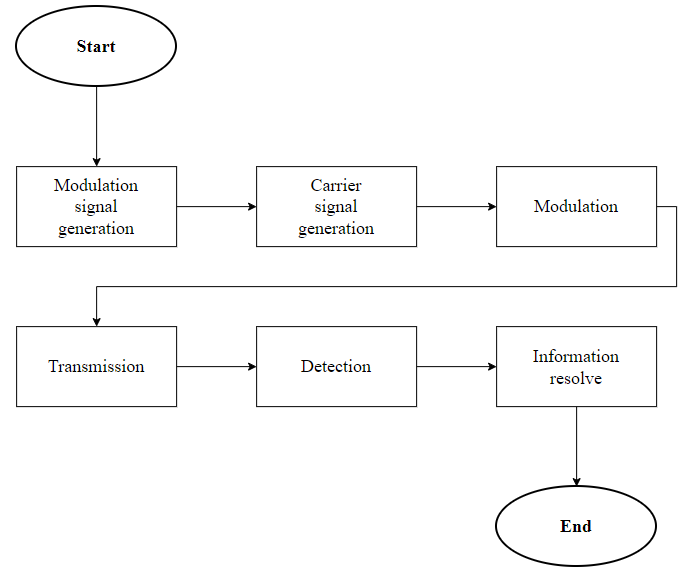
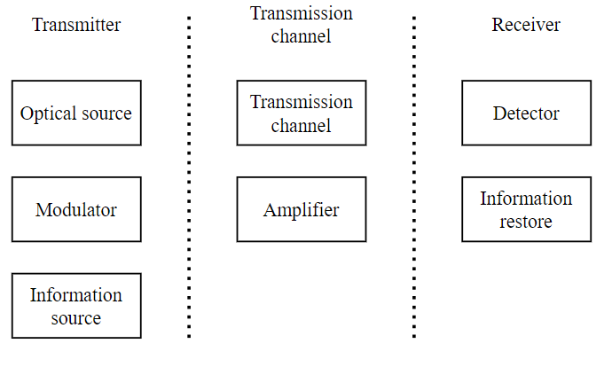
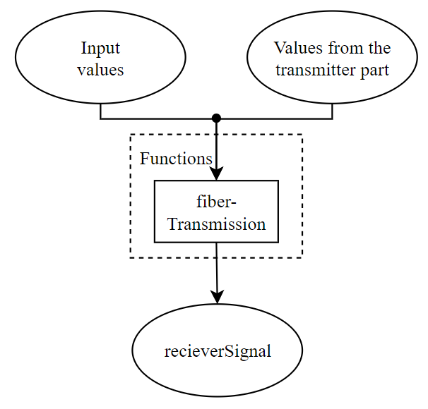
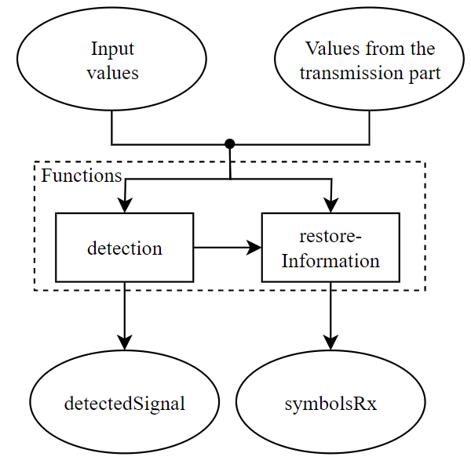

# Basic logic

As mentioned before the idea of application is to display communication model. With this model user can control the simulation. The basic structure of simulation is similar to the real communication channel which means that steps done in simulation process are inspired by steps of real signal processing. For this approach OptiCommPy package was really useful because it provides models and functions to follow this concept.

> *Steps of simulation*

{: style="width:65%;"}

For better understanding the logic of the simulation will be divided into three sections. First one is transmitter which contains optical source, information source and modulator. Second one is transmission channel with amplifier. Last one is receiver which contains detector and information restore.

> *Divided communication channel*

{: style="width:60%;"}

## Data storage

In the application data storing is done by dictionaries. The key property of dictionary is that it stores information as key, value pairs. Also no duplicate keys are allowed. Every time as a key a parameter name is used. That means two same parameters cannot be stored that could happen by accident. Another reason for using dictionaries is that when a parameter value is needed you can get it from dictionary by its name (key). This should make the program more readable.

Graphical outputs are also stored in dictionary. In this case the value is a figure, axes tuple. Figure and axes are objects from matplotlib package. Figures are then displayed using tkinter canvas.

## Transmitter

The generation of the **modulation signal** can be divided into three steps. In the first step, a random sequence of bits is generated to represent the information to be transmitted. These bits are then used to form symbols. The symbol words are formed with Gray's code and are directly influenced by the format and modulation order settings specified by the user (general parameters). The last step is the generation of the signal pulses. In this step, a large number of samples are generated from a sequence of symbols that together represent a continuous modulation signal.

The generation of the **carrier signal** is logically performed after the modulation signal. This is because the modulation signal and the carrier signal must have the same number of signal samples. The carrier signal has constant power and constant phase.

The last task of the transmitting part is to perform the **modulation**. This task already requires knowledge of the modulation and carrier signals, which are the input parameters of the different modulator models. The output is the modulated signal.

> *Basic transmitter logic*

{: style="width:60%;"}

## Transmission channel

**Transmission channel** and **amplifier** can form the following combinations. Each combination has a little different logic.

* Ideal transmission channel without amplifier
* Ideal transmission channel with ideal amplifier
* Ideal transmission channel with non-ideal amplifier
* Transmission channel without amplifier
* Transmission channel with ideal amplifier
* Transmission channel with non-ideal amplifier

In case of combination with only the ideal transmission channel, i.e. without amplifier, the modulated signal is transmitted directly to the output. This is the simplest case. Similar is case of an ideal transmission channel and a general amplifier. In case of ideal channel position of amplifier doesn't matter.

Where position can no longer be ignored are combinations with a non-ideal transmission channel and a general amplifier. In this case, the position of the amplifier plays a big role and the connection of the simulation models is adapted to this. As an example, if the amplifier is placed in the middle of the channel length that is input by the user is divided in half. The first half is then placed in front of the amplifier and the second half behind it.

There is also a significant difference between using an ideal and a non-ideal amplifier. In case of non-ideal amplifier a condition if the input signal has enough power is tested (this power limit is one of amplifiers parameters).  If this input power isn't enough, the user is alerted to this fact and the simulation is not completed.

> *Basic transmission channel logic*

{: style="width:45%;"}

## Receiver

Two types of detection are available, simple intensity detection with a photodiode and coherent detection with multiple photodiodes. The output of detection model is the signal after detection, from which the symbols are read out.

> ***Note:*** *Detected symbols are formed back to bits which are not used in the application*

> *Basic receiver logic*

{: style="width:45%;"}