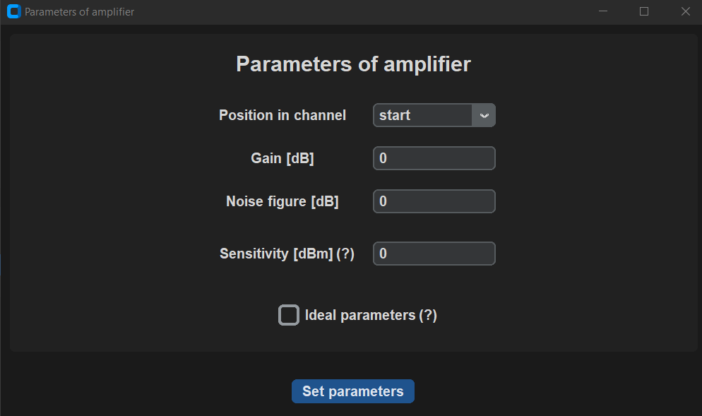
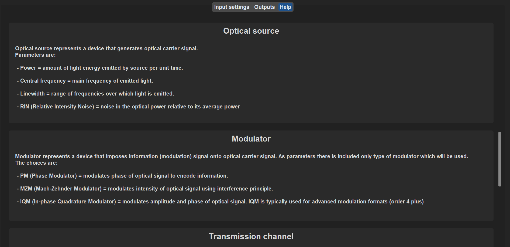
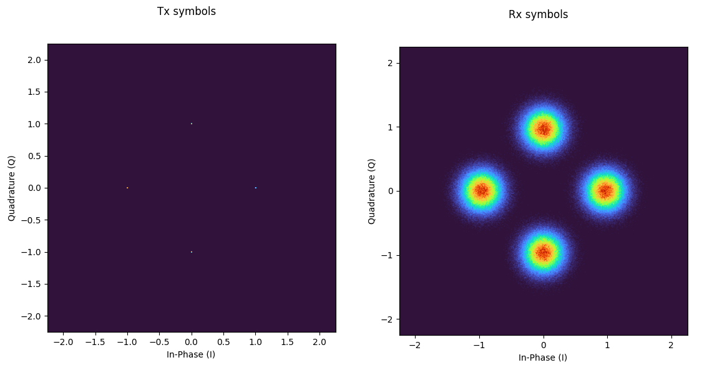
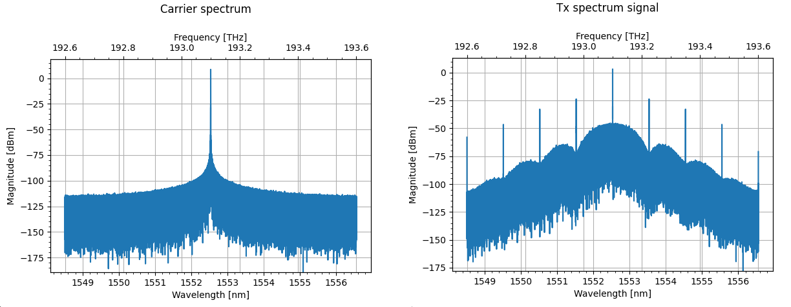

# Screenshots

### GUI screenshots

> ***Main window with settings***

> ***Window to set parameters of amplifier***

{: style="width:60%;"}

> ***Outputs tab***

> ***Help tab***

### Outputs screenshots

> ***OOK modulated signal***

{: style="width:80%;"}

> ***PSK modulated signal***

{: style="width:80%;"}

> ***QPSK constallations diagrams***

> ***Carrier and OOK spectrum***

> ***PAM4 eye diagrams***

{: style="width:80%;"}